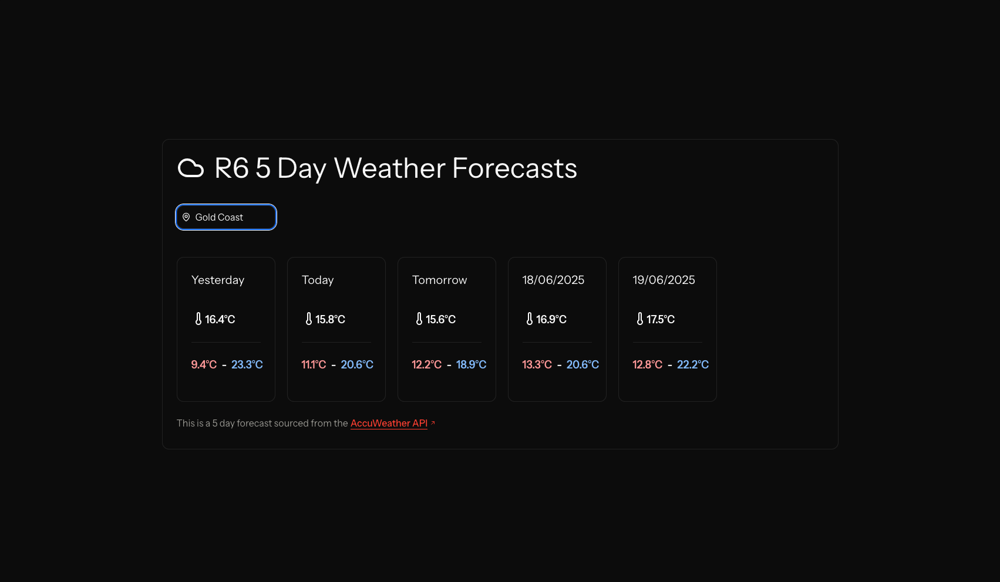

# R6


This project was scaffolded with Laravel Herd so ideally, run the website through that as well, attaching it as an existing project and running `herd link` in the repository directory. Note that this repository was developed on MacOS, there may be some differences for Windows environments.

# Getting started

## Installation
Without the use of Herd, you should be able to run the project using by using the following instructions

Clone the repository 

`git clone https://github.com/sh1ggy/r6.git`

Install dependencies

`composer install --ignore-platform-reqs`

`npm i && npm run build`

To create the SQLite DB used by the cache

`php artisan migrate`

## Environment
AccuWeather requires an API key as a part of the environment. 

An `.env.example` has been provided as a part of this repository, please copy it and replace **Line 67** with your API key provided by AccuWeather.

`API_KEY="API KEY HERE"`

## Running
`composer run dev`

# Troubleshooting
- Ensure that port 9001 is not being taken by any other service on your computer if it is please terminate it or adjust the port in Herd. 

## Windows-Specific
Windows reuqired some massaging of the php environment, please follow the below if you run into any issues.

- Run `php --ini` and ensure that if your `variables_order = "EGPCS"` instead set it to `variables_order = "GPCS"`
- If you're getting the following error: 

`Script npx concurrently -c "#93c5fd,#c4b5fd,#fb7185,#fdba74" "php artisan serve" "php artisan queue:listen --tries=1" "php artisan pail --timeout=0" "npm run dev" --names=server,queue,logs,vite --kill-others handling the dev event returned with error code 1` 

or the following stacktrace

```
[logs] The [pcntl] extension is required to run Pail.
[logs]
[logs]   at vendor\laravel\pail\src\Guards\EnsurePcntlIsAvailable.php:15
[logs]      11▕      */
[logs]      12▕     public static function check(): void
[logs]      13▕     {
[logs]      14▕         if (! function_exists('pcntl_fork')) {
[logs]   ➜  15▕             throw new RuntimeException('The [pcntl] extension is required to run Pail.');
[logs]      16▕         }
[logs]      17▕     }
[logs]      18▕ }
[logs]      19▕
```

Please run `composer run dev:windows` instead 😁
